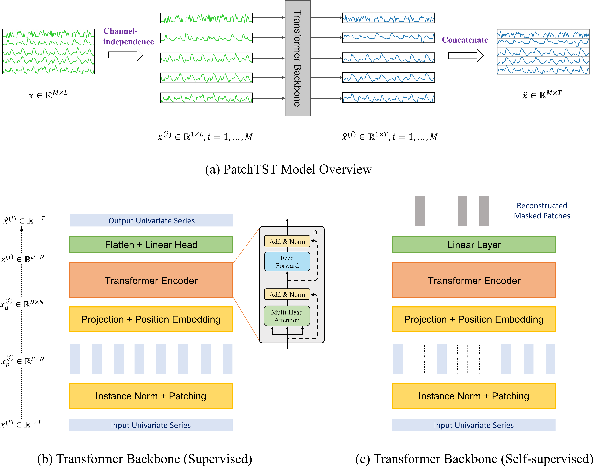
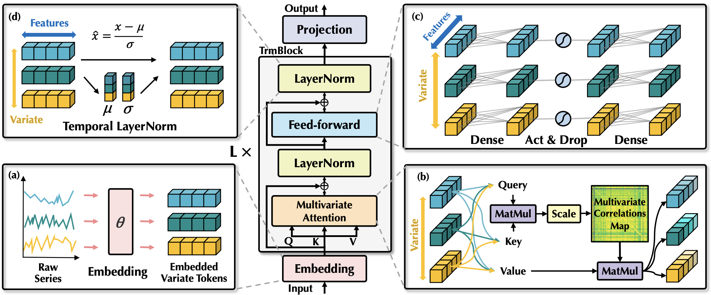

# 时序预测模型综述：从线性模型到 Transformer

## 1. 前言

时间序列预测是数据挖掘中的核心任务之一，广泛应用于金融、气象、能源等领域。随着深度学习的发展，时序预测模型经历了从传统的统计模型（如 ARIMA）到基于 RNN/CNN 的深度模型，再到如今基于 Transformer 的各类变体的演进。

虽然近年来“时序大模型”（Foundation Models）备受关注，但在实际工业落地和特定场景中，针对性设计的“传统”深度学习模型往往能以更小的计算代价取得极佳的效果。本文将详细探讨几类具有代表性的非大模型时序预测方法，包括线性模型、Transformer 变体以及结合流形学习的创新架构。

## 2. 线性模型 (Linear Models)

尽管深度学习模型层出不穷，但简单的线性模型往往能作为强有力的 Baseline，甚至在某些数据集上超越复杂的 Transformer。

### 2.1 DLinear (Decomposition Linear)

DLinear 是一种极其简单但有效的模型，它结合了传统时序分析中的**趋势-季节性分解**（Trend-Seasonality Decomposition）思想。

**核心原理：**
DLinear 将输入序列 $X$ 分解为两个部分：趋势项（Trend）和季节项（Seasonality）。

$$
X = X_{trend} + X_{season}
$$

其中，趋势项通常通过移动平均（Moving Average）提取，季节项则是原序列减去趋势项。

**模型架构：**
DLinear 使用两个独立的单层线性层（Linear Layer）分别处理这两部分，最后将结果相加。

**数学公式：**

$$
\begin{aligned}
X_{trend} &= \text{MovingAvg}(X) \\
X_{season} &= X - X_{trend} \\
\hat{Y}_{trend} &= \text{Linear}_{trend}(X_{trend}) \\
\hat{Y}_{season} &= \text{Linear}_{season}(X_{season}) \\
\hat{Y} &= \hat{Y}_{trend} + \hat{Y}_{season}
\end{aligned}
$$

**代码实现参考：**
在本项目 `models/models.py` 中，DLinear 被实现为：
```python
class DLinear(nn.Module):
    def __init__(self, seq_len, pred_len, input_dim):
        super().__init__()
        self.Linear_Trend = nn.Linear(seq_len, pred_len)
        self.Linear_Seasonal = nn.Linear(seq_len, pred_len)
        self.decompsition = SeriesDecomp(kernel_size=25)
```

**特点：**
- **计算复杂度低**：$O(1)$（相对于序列长度的注意力复杂度）。
- **抗过拟合**：参数量极少。
- **可解释性强**：明确分离了长期趋势和短期波动。

## 3. Transformer 类模型

Transformer 最初用于 NLP，直接应用到时序数据时面临计算复杂度高（$O(L^2)$）和难以捕捉时序特性的问题。近年来的改进主要集中在 **Patching** 和 **Inverted Architecture** 上。

### 3.1 PatchTST (Patch Time Series Transformer)

PatchTST 通过引入 **Patching** 和 **Channel Independence** 彻底改变了 Transformer 在时序领域的应用方式。

<p align="center">
  
  <br>
  <em>图 1: PatchTST 架构示意图。利用 Patching 降低计算复杂度，利用 Channel Independence 提高泛化能力。</em>
</p>

**核心原理：**
1.  **Patching（分块）**：将长序列切分为短的时间片（Patch），类似于 NLP 中的 Token。这不仅降低了 Attention 的计算量（从 $L$ 降到 $L/S$），还保留了局部语义信息。
2.  **Channel Independence（通道独立）**：多变量时间序列的每个变量（Channel）共享同一个 Transformer 骨干网络，互不干扰。这大大增加了训练数据量，提高了泛化性。

**数学公式：**
给定输入 $x^{(i)}$ (第 $i$ 个变量的序列)：
1.  **Unfold**: $x^{(i)} \in \mathbb{R}^{L} \rightarrow x_p^{(i)} \in \mathbb{R}^{N \times P}$，其中 $P$ 是 Patch 长度，$N$ 是 Patch 数量。
2.  **Embedding**: $E^{(i)} = x_p^{(i)} W_e + W_{pos}$
3.  **Transformer**: $Z^{(i)} = \text{TransformerEncoder}(E^{(i)})$
4.  **Flatten & Head**: $\hat{y}^{(i)} = \text{Linear}(\text{Flatten}(Z^{(i)}))$

**代码实现参考：**
见 `models/models.py` 中的 `PatchTST` 类：
```python
# Patching 操作
self.patch_embed = nn.Linear(patch_len, d_model)
# 仅仅使用 Encoder
self.transformer = nn.TransformerEncoder(encoder_layer, num_layers=n_layers)
```

### 3.2 iTransformer (Inverted Transformer)

iTransformer 提出了 **Inverted Architecture**（倒置架构），对 Transformer 的维度进行了翻转。

<p align="center">
  
  <br>
  <em>图 2: iTransformer 架构示意图。将整个时间序列视为一个 Token，Attention 发生在变量（Variate）之间。</em>
</p>

**核心原理：**
传统的 Transformer 将时间步作为 Token（Time as Token），而 iTransformer 将整个序列的一个变量作为 Token（Variate as Token）。
- **Embedding**：将每个变量的时间序列 $X_{:, i} \in \mathbb{R}^{L}$ 映射为高维向量 $h_i \in \mathbb{R}^{D}$。
- **Attention**：计算变量之间的相关性。这意味着模型学习的是变量间的依赖关系（Multivariate Correlations），而非时间步之间的依赖。

**数学公式：**
输入 $X \in \mathbb{R}^{B \times L \times C}$ (Batch, Length, Channels)。
1.  **Permute & Embed**: $H = \text{MLP}(X^T) \in \mathbb{R}^{B \times C \times D}$。
2.  **Self-Attention**: $\text{Attention}(H, H, H)$ 计算通道间的注意力。
3.  **Feed Forward**: 独立处理每个通道的特征。
4.  **Projection**: $Y = \text{MLP}(H_{out}) \in \mathbb{R}^{B \times C \times PredLen}$。

**代码实现参考：**
见 `models/models.py` 中的 `iTransformer` 类：
```python
# 将时间维度 permute 到最后进行 Embedding
x = x.permute(0, 2, 1) # [B, C, L]
enc_out = self.enc_embedding(x) # [B, C, D]
# Transformer 处理的是 C 个 Token
enc_out = self.transformer(enc_out)
```

### 3.3 MHC-iTransformer (Multi-Head Co-training)

本项目中还包含了一个创新的变体 `MHC_iTransformer`，它在 iTransformer 的基础上引入了流形学习和多头协同训练机制。

**核心创新：**
- **Multi-Stream**: 引入 $N$ 个并行的流（Streams），每个流代表不同的子空间表示。
- **Sinkhorn Projection**: 使用 Sinkhorn 算法生成双随机矩阵（Doubly Stochastic Matrix），用于在不同流之间进行特征混合（Manifold Mixing）。
- **Co-training**: 通过加权聚合（Aggregation）不同流的信息来增强表示能力。

**代码实现参考：**
见 `models/mhc_itransformer.py`：
```python
# Sinkhorn 混合
x_stream = torch.einsum('mn,bncd->bmcd', W_attn, x_stream) + phi_attn * attn_out.unsqueeze(1)
```

## 4. 特殊机制 (Special Mechanisms)

除了模型架构，一些通用的预处理和后处理机制对提升性能至关重要。

### 4.1 RevIN (Reversible Instance Normalization)

**问题：** 时间序列数据通常存在 **分布偏移**（Distribution Shift），即训练集和测试集的统计特性（均值、方差）不一致。

**解决方案：** RevIN 通过两步操作解决此问题：
1.  **Normalization (前向)**：在模型输入前，减去均值除以标准差。

    $$ x' = \gamma \frac{x - \mu}{\sigma} + \beta $$

2.  **Denormalization (后向)**：在模型输出后，反向恢复分布。

    $$ \hat{y} = \frac{\hat{y}' - \beta}{\gamma} \cdot \sigma + \mu $$

本项目的所有模型（DLinear, PatchTST, iTransformer）均集成了 RevIN 模块。

### 4.2 DUET (Channel Transformer with Mahalanobis Mask)

在 `models/DUET.py` 中，实现了一种基于马氏距离（Mahalanobis Distance）的通道注意力机制。

**核心思想：**
- 利用马氏距离衡量不同通道（变量）之间的相似度。
- 根据相似度生成 Mask，指导 Channel Transformer 关注相关性强的变量组合。

## 5. 总结与展望

| 模型 | 核心思想 | 适用场景 | 复杂度 |
| :--- | :--- | :--- | :--- |
| **DLinear** | 趋势-季节分解，全连接层 | 具有明显趋势/周期的简单序列 | 低 |
| **PatchTST** | Patching + 通道独立 | 长序列预测，强调单个变量的历史模式 | 中 |
| **iTransformer** | 变量即 Token，通道注意力 | 多变量相关性强的场景 | 中 |
| **MHC-iTransformer** | 多流形协同训练 | 复杂分布，需要增强鲁棒性的场景 | 高 |

在实际应用中，建议从 DLinear 开始建立 Baseline，对于长序列预测首选 PatchTST，而对于变量间关系复杂的任务则尝试 iTransformer。

## 参考资料

1.  **DLinear**: [Are Transformers Effective for Time Series Forecasting?](https://arxiv.org/abs/2205.13504)
2.  **PatchTST**: [A Time Series is Worth 64 Words: Long-term Forecasting with Transformers](https://arxiv.org/abs/2211.14730)
3.  **iTransformer**: [iTransformer: Inverted Transformers are Effective for Time Series Forecasting](https://arxiv.org/abs/2310.06625)
