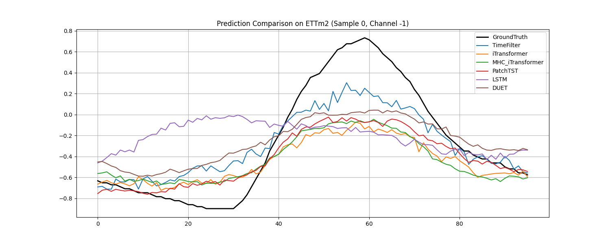
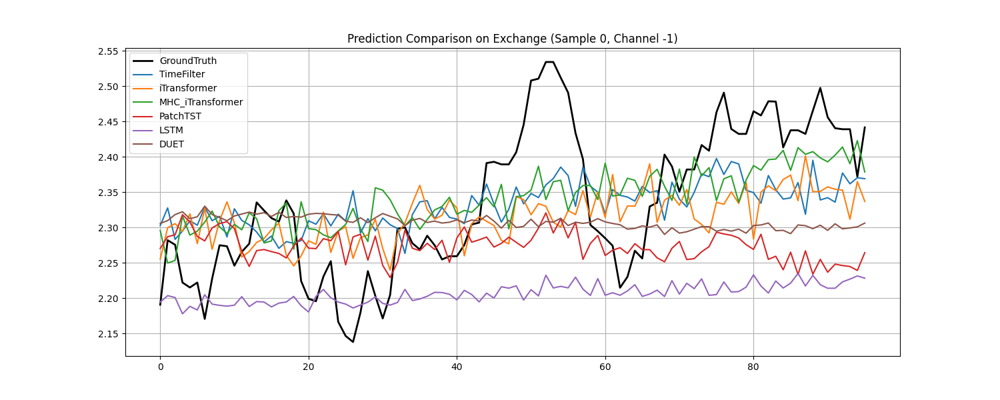

# MHC_time_series

本项目是一个时间序列预测研究项目，主要探索和对比了多种先进的深度学习模型在特定时间序列数据集上的表现。

## 项目简介

本项目实现了以下模型用于时间序列预测：

- **PatchTST**: 基于 Patch 的时间序列 Transformer 基准模型。
- **iTransformer**: 倒置 Transformer (Inverted Transformer) 模型，通过将维度与时间序列对换来捕获多变量相关性。
- **MHC-iTransformer**: **本项目核心改进模型**，将mHC与 iTransformer 结合。
- **DUET**: Dual-Exporer Time Series Forecasting Model，一种新集成的强力预测模型。
- **TimeFilter**: 基于频域滤波的时间序列预测模型。
- **LSTM**: 经典的深度学习基线模型。

## MHC-iTransformer 详细说明

MHC-iTransformer 在原始 iTransformer 的基础上引入了 ** (MHC)** 机制，旨在增强模型对复杂时间序列模式的捕捉能力。

### 1. 核心原理
- **多视图流 (Multi-stream)**: 不同于传统 Transformer 维护单一的状态，MHC 维护 $N$ 个并行的信息流（Streams/Views）。每个流可以捕捉时间序列的不同特征。
- **倒置维度 (Inverted Embedding)**: 继承 iTransformer 的特性，将每个变量的整条序列映射为 Token，使得 Attention 机制在变量维度而非时间维度上运行。
- **Sinkhorn 投影流形**: 使用 Sinkhorn 算法确保流与流之间的转移矩阵 $W$ 是双随机（Doubly Stochastic）的，保证了信息在传递过程中的守恒与多样性。

### 2. 核心公式
MHC Block 的状态更新遵循以下残差逻辑：

$$H_{l+1} = H_l \cdot W + \phi \cdot \text{Sublayer}(\text{Agg}(H_l))$$

其中：
- $H_l$: 第 $l$ 层的多视图流状态。
- $W$: 经过 Sinkhorn 投影的流转移矩阵，负责流间的信息交换。
- $\text{Agg}(H_l)$: 通过注意力加权聚合多个流的信息作为子层输入。
- $\text{Sublayer}$: 代表多头注意力（Attention）或前馈网络（FFN）。
- $\phi$: 可学习的门控参数，控制子层输出对各流的影响。

### 3. 主要改进点
- **增强的鲁棒性**: 通过多视图机制，模型能够同时关注局部细节和全局趋势，对噪声数据具有更强的鲁棒性。
- **非平稳性处理**: 集成了 **RevIN (Reversible Instance Normalization)**，有效解决了时间序列分布随时间偏移的问题。
- **信息交换流形**: 引入 Sinkhorn 投影，使得模型在学习复杂变量间关系时具有更优的几何约束。

## 实验结果

项目在多个标准 Benchmark 数据集上进行了对比实验。详细的实验报告请参阅 [experiment_report_zh.md](experiment_report_zh.md)。

以下是 MHC-iTransformer 与基准模型的预测效果对比示例：






## 项目结构

```text
.
├── datasets/           # 数据集目录 (闭源)
├── docs/               # 相关文档
├── models/             # 模型定义与数据处理工具
│   ├── data_utils.py   # 数据加载与预处理 (含 PCA 降维逻辑)
│   ├── models.py       # PatchTST, iTransformer, LSTM 定义
│   ├── mhc_itransformer.py # MHC-iTransformer 定义 (核心)
│   ├── DUET.py         # DUET 模型定义
│   └── time_filter.py  # TimeFilter 模型定义
├── results/            # 训练结果与可视化图表
├── requirements.txt    # 项目依赖
├── main.py             # 单次训练入口脚本
└── run_all.py          # 批量实验脚本 (复现实验推荐)
```

## 安装指南

1. 确保已安装 Python 3.8+。
2. 安装项目依赖：

```bash
pip install -r requirements.txt
```

## 运行方法

### 1. 复现完整实验

使用 `run_all.py` 脚本可以自动在指定数据集（默认 Electricity）或所有数据集上运行所有模型，并生成对比报告和图表。脚本会自动对比 **Adam**、**AdamW** 和 **Muon** 三种优化器的效果，并记录训练/推理时间。

```bash
# 默认运行 Electricity 数据集
python run_all.py

# 指定运行 ETTh1 数据集
python run_all.py --dataset ETTh1

# 运行所有数据集
python run_all.py --dataset ALL
```

> **注意**: 脚本默认使用 GPU 设备 1。

### 2. 单次训练

可以通过 `main.py` 运行单个模型的训练，并支持指定优化器。

```bash
# 默认使用 Adam
python main.py --model MHC_iTransformer --data ETTh2 --root_path ./datasets/ETT-small/ --data_path ETTh2.csv

# 指定使用 AdamW
python main.py --model MHC_iTransformer ... --optimizer AdamW

# 指定使用 Muon (混合优化器)
python main.py --model MHC_iTransformer ... --optimizer Muon
```

## 优化器支持与说明

本项目新增了对 **AdamW** 和 **Muon** (及其混合模式) 优化器的支持与对比，并在结果中增加了 **训练时间 (Training Time)** 和 **推理时间 (Inference Time)** 指标。

> **特别提醒**: 
> 这里的优化器对比旨在提供更广泛的实验视角。在大多数时间序列预测场景下，**Adam** 和 **AdamW** 已经是表现相对最好的一档优化器。
> **Muon** 优化器（或混合 Muon+AdamW）主要设计用于 **大模型 (LLM)** 训练场景（面对超大规模的矩阵路径），在当前的时间序列任务中并不能保证提供提升，甚至可能不如经典优化器。

#### 高维数据处理 (PCA)

对于协变量极多的数据集（如 Traffic 和 Electricity），为了避免 OOM（显存溢出）并加速训练，本项目支持使用 PCA 进行特征降维。

```bash
# 将特征维度降至 30
python main.py --model MHC_iTransformer --data Traffic --pca_dim 30 ...
```

## 注意事项

- **数据集**: 本项目使用的数据集置于 `datasets/` 目录下的相应子目录中，全部来自于iTransformer项目整理（感谢）,数据集过大无法上传至GitHub,请在运行前手动下载并放置于对应目录。
下载方式请见：iTransformer项目https://drive.google.com/file/d/1l51QsKvQPcqILT3DwfjCgx8Dsg2rpjot/view。请下载后放到工作区的datasets/目录下，并利用unzip解压缩，得到datasets/iTransformer_datasets目录，存放所有数据集。
- **计算资源**: 建议在支持 CUDA 的 GPU 环境下运行。对于高维数据集，建议开启 PCA 降维。
