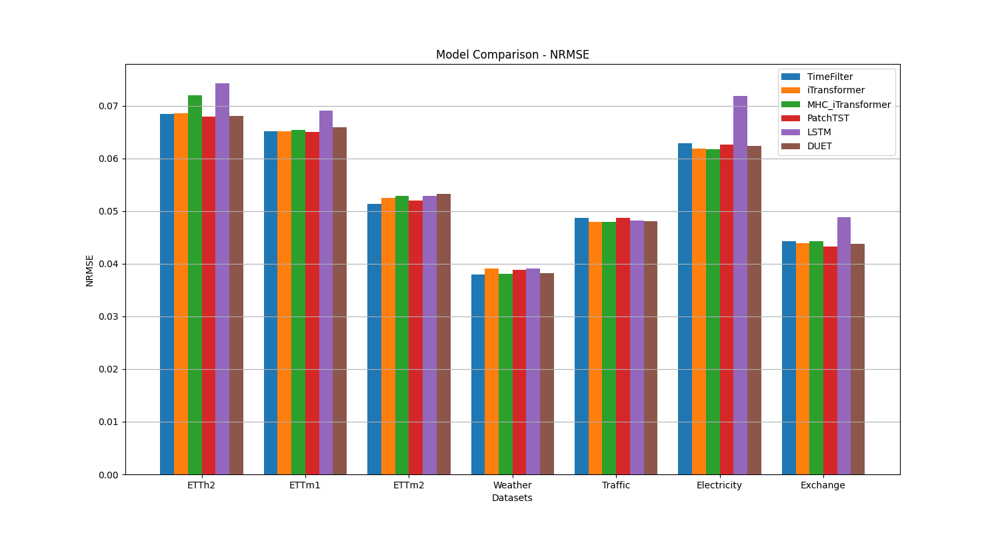
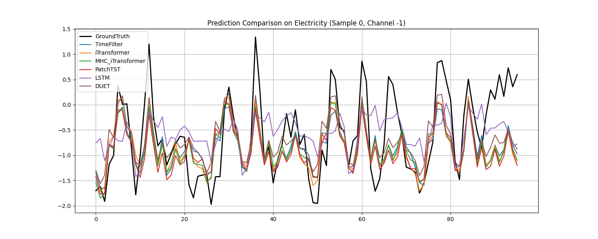
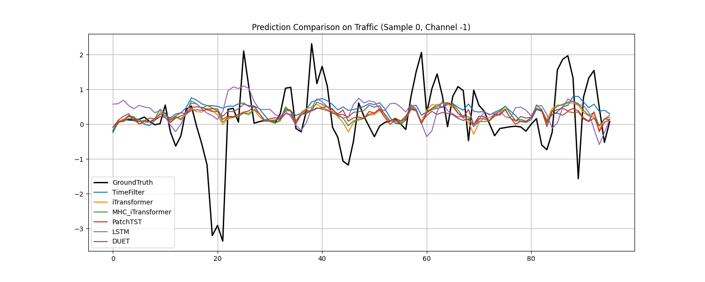
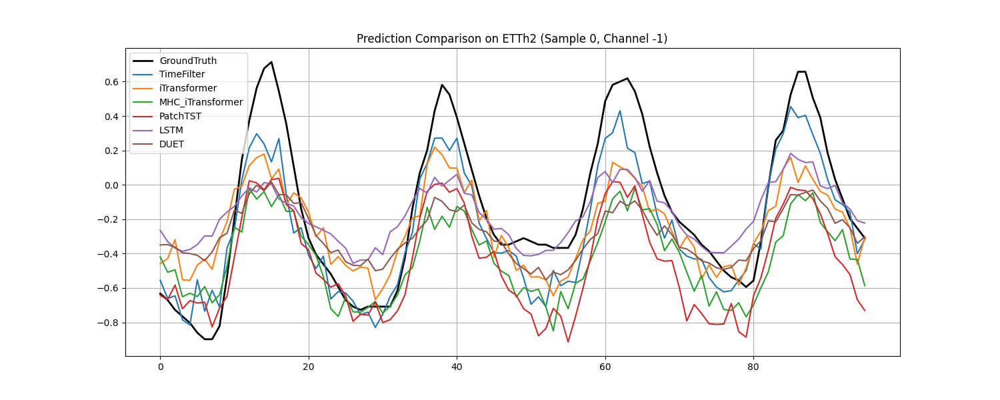
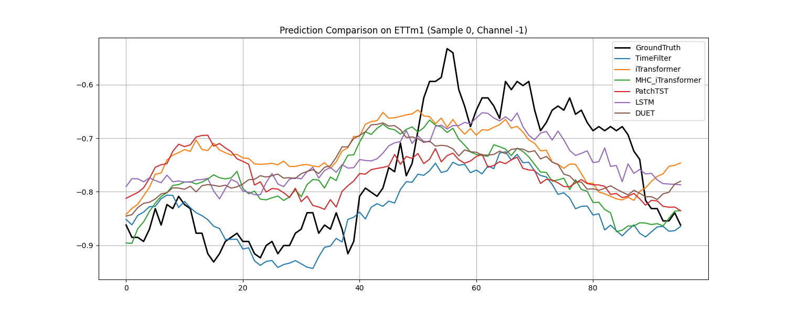
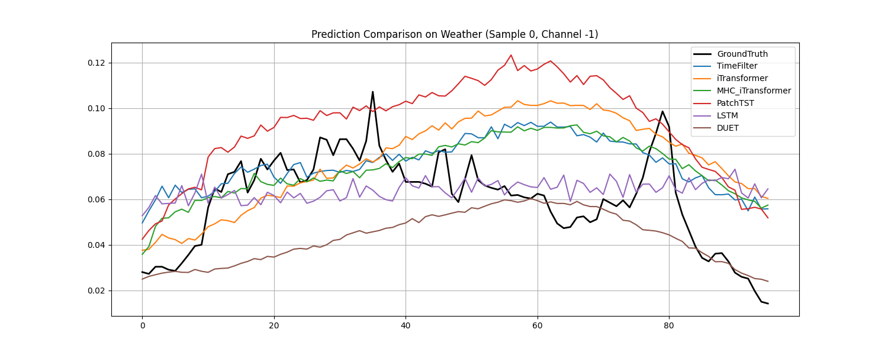

# MHC-Time-Series: Advanced Time Series Forecasting


本项目是一个专注于时间序列预测的研究项目，旨在探索和对比多种先进深度学习模型（如 PatchTST, iTransformer）在特定数据集上的表现。同时，本项目提出了一种改进的 **MHC-iTransformer** 架构，结合了多头协同（MHC）与流形学习机制。

---

## 精选博客 | Featured Blogs

我们提供了两篇深度综述博客，帮助读者快速了解领域前沿与本项目核心技术：

| 博客主题 | 内容简介 | 阅读链接 |
| :--- | :--- | :---: |
| **时序大模型综述** | 涵盖 2023-2026 年主流时序大模型（Foundation Models），全面分析其创新点与性能。 | [](Blogs/时序综述-大模型.md) |
| **传统/创新模型实战** | 深入解析 DLinear, PatchTST, iTransformer 及本项目提出的 MHC-iTransformer 原理与实现。 | [](Blogs/时序-个人推荐.md) |

---

## 支持模型 | Supported Models

本项目实现了以下模型，涵盖了从线性基线到最新的 Transformer 变体：

| 模型 | 类型 | 简介 |
| :--- | :--- | :--- |
| **PatchTST** | Transformer | 基于 Patch 的时序 Transformer，利用 Channel Independence 提升泛化能力。 |
| **iTransformer** | Transformer | 倒置架构（Inverted Architecture），将变量视为 Token 捕捉多变量相关性。 |
| **MHC-iTransformer** | **Ours** | **本项目核心改进**，在 iTransformer 基础上引入 MHC 多视图流与 Sinkhorn 投影。 |
| **DUET** | Ensemble | Dual-Exporer 模型，强力集成预测方案。 |
| **TimeFilter** | Frequency | 基于频域滤波的创新预测模型。 |
| **DLinear** | Linear | 简单的线性分解模型，强有力的 Baseline。 |
| **LSTM** | RNN | 经典的深度学习基线模型。 |

---

## MHC-iTransformer 详解

MHC-iTransformer 是本项目的核心创新点。它参考了 DeepSeek 的 MHC 结构，在 iTransformer 的基础上引入了 **多视图协同 (Multi-Head Co-training)** 机制。

### 核心特性
- **多视图流 (Multi-stream)**: 维护 $N$ 个并行信息流，捕捉不同维度的时序特征。
- **Sinkhorn 流形投影**: 使用 Sinkhorn 算法生成双随机矩阵，确保信息流转的守恒性与多样性。
- **鲁棒性增强**: 在私有大型电力负荷数据集上表现优于原始 iTransformer。

### 关键公式
状态更新遵循残差逻辑：
$$H_{l+1} = H_l \cdot W + \phi \cdot \text{Sublayer}(\text{Agg}(H_l))$$
其中 $W$ 为 Sinkhorn 投影后的流转移矩阵。

---

## 实验结果 | Experiments

项目在多个标准 Benchmark 上进行了对比。详细报告请参阅 [实验报告](experiment_report_zh.md)。

### 性能对比


### 预测可视化
<details>
<summary>点击展开查看各数据集预测效果图</summary>

| 数据集 | 预测效果 |
| :---: | :---: |
| **Electricity** |  |
| **Traffic** |  |
| **ETTh2** |  |
| **ETTm1** |  |
| **Weather** |  |

</details>

---

## 快速开始 | Quick Start

### 1. 环境准备
```bash
git clone https://github.com/your_username/MHC_time_series.git
cd MHC_time_series
pip install -r requirements.txt
```

### 2. 复现完整实验
使用 `run_all.py` 脚本可以自动在指定数据集（默认 Electricity）或所有数据集上运行所有模型，并生成对比报告和图表。

```bash
# 默认运行 Electricity 数据集
python run_all.py

# 指定运行 ETTh1 数据集
python run_all.py --dataset ETTh1

# 运行所有数据集
python run_all.py --dataset ALL
```

### 3. 单次训练
可以通过 `main.py` 运行单个模型的训练，并支持指定优化器。

```bash
# 默认使用 Adam
python main.py --model MHC_iTransformer --data ETTh2 --root_path ./datasets/ETT-small/ --data_path ETTh2.csv

# 指定使用 AdamW
python main.py --model MHC_iTransformer ... --optimizer AdamW

# 指定使用 Muon (混合优化器)
python main.py --model MHC_iTransformer ... --optimizer Muon
```

---

## 优化器与高级特性 | Advanced Features

### 优化器支持
本项目新增了对 **AdamW** 和 **Muon** (及其混合模式) 优化器的支持与对比，并在结果中增加了 **训练时间** 和 **推理时间** 指标。
> **特别提醒**: Muon 优化器主要设计用于大模型 (LLM) 训练，在当前的时间序列任务中并不能保证提供提升，甚至可能不如经典优化器。

### 高维数据处理 (PCA)
对于协变量极多的数据集（如 Traffic 和 Electricity），为了避免 OOM（显存溢出）并加速训练，本项目支持使用 PCA 进行特征降维。

```bash
# 将特征维度降至 30
python main.py --model MHC_iTransformer --data Traffic --pca_dim 30 ...
```

---

## 注意事项与数据集 | Attention & Datasets

### 数据集获取
- **数据集**: 本项目使用的数据集置于 `datasets/` 目录下的相应子目录中，全部来自于 iTransformer 项目整理（感谢）。**数据集过大无法上传至 GitHub, 请在运行前手动下载并放置于对应目录。**
- **下载方式**: 请见 iTransformer 项目分享 [Google Drive 链接](https://drive.google.com/file/d/1l51QsKvQPcqILT3DwfjCgx8Dsg2rpjot/view)
- **安装步骤**: 请下载后放到工作区的 `datasets/` 目录下，并利用 `unzip` 解压缩，得到 `datasets/iTransformer_datasets` 目录，存放所有数据集。

### 计算资源
- **建议环境**: 建议在支持 CUDA 的 GPU 环境下运行。
- **内存优化**: 对于高维数据集，建议开启 PCA 降维。

---

## 项目结构
```text
.
├── datasets/           # 数据集目录 (需手动下载)
├── docs/               # 相关文档
├── models/             # 模型源码
│   ├── mhc_itransformer.py # MHC-iTransformer 核心实现
│   ├── models.py       # PatchTST, iTransformer, DLinear 等
│   ├── DUET.py         # DUET 模型
│   └── time_filter.py  # TimeFilter 模型
├── Blogs/              # 综述与技术博客
├── results/            # 实验结果与图表
├── main.py             # 单次训练入口
└── run_all.py          # 批量实验脚本
```
